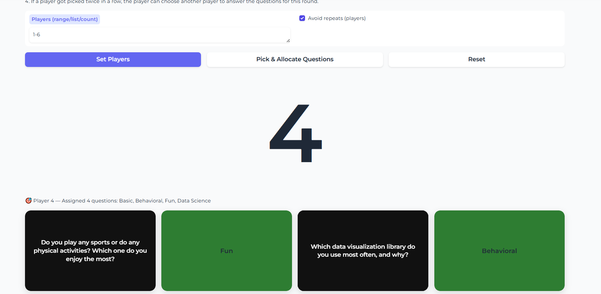

# Icebreaker Game 🎉

A fun **Gradio web app** for hosting icebreaker sessions with data science students. The app randomly selects a player and assigns them one or more **icebreaker questions** from different categories. Players flip cards to reveal their questions and keep the conversation flowing!

---

## ✨ Features

- 🎲 **Random Player Selection**  
  Enter the number of players, a range, or a custom list. The app randomly selects who goes next.

- 🃏 **Card Flip Questions**  
  Each round, the app flips over cards from four categories:
  - **Basic**  
  - **Fun**  
  - **Data Science**  
  - **Behavioral**

- ✅ **Repeat Control**  
  Option to avoid repeating players until everyone has been picked once.

- 📜 **Custom Question Pools**  
  Load your own text files (`basic.txt`, `fun.txt`, `datascience.txt`, `behav.txt`) — one question per line. If files are missing, fallback seed questions are used.

- 🎨 **Interactive UI**  
  Stylish card-flip animations with clear instructions and player tracking.

---

## 🚀 Getting Started

### 1. Clone the repo
```bash
git clone https://github.com/yourusername/icebreaker-game.git
cd icebreaker-game
```

### 2. Install dependencies
Python 3.9+
```bash
pip install -r requirements.txt
```


### 3. Simply run the script
```bash
python app.py
```

The app will start and open in your browser at:
```bash
http://127.0.0.1:7860
```

### 4. Screenshot of the APP


